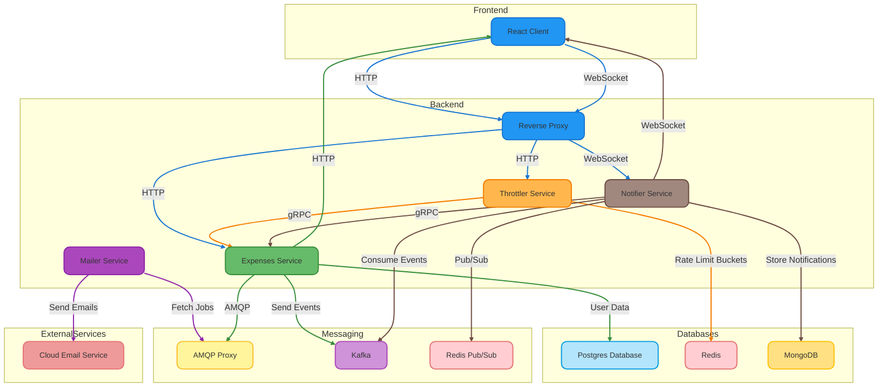

# Debt Tracker

A simple platform designed to keep track of debts; how much you owe, how much is expected to be received, and the history of debts given and received. This project consists of five applications, four of which are written in Go, and the frontend is built with React.

## System Architecture



## Table of Contents

- [Overview](#overview)
- [Applications](#applications)
  - [Expenses Service](#expenses-service)
  - [Mailer Service](#mailer-service)
  - [Throttler Service](#throttler-service)
  - [Notifier Service](#notifier-service)
  - [Frontend Application](#frontend-application)
- [Infrastructure](#infrastructure)
- [CI/CD Pipeline](#ci-cd-pipeline)
- [Future Plans](#future-plans)
- [Getting Started](#getting-started)
- [Contributing](#contributing)
- [License](#license)

## Overview

This platform allows users to manage their debts and transactions efficiently. Users can record debts, monitor what is owed, and see a detailed history of transactions. The backend services are containerized and orchestrated using Kubernetes, with Helm Charts facilitating deployment.

## Applications

### Expenses Service

The **Expenses Service** is the core of the platform. It handles:

- **User Management**: Registration, authentication, and user data management using a Postgresql database.
- **Debt and Transaction Management**: Create, update, and monitor debts and transactions.
- **Gateway Functionality**: Serves as the entry point for the web frontend via an HTTP server.
- **gRPC Server**: Used for efficient inter-service communication, particularly for fetching user information.
- **Messaging Integration**: Assigns OTP mailing jobs to a messaging proxy and publishes debt and transaction events to Kafka topics.

### Mailer Service

The **Mailer Service** is responsible for sending emails, such as OTPs, to users. It:

- **Fetches Mailing Jobs**: Retrieves jobs from an AMQP proxy.
- **Email Sending**: Uses a cloud service API to send emails over the public internet.
- **Resilience**: Implements exponential backoff with jitter for retrying failed email sends.

### Throttler Service

The **Throttler Service** provides centralized rate limiting. It:

- **Identity Verification**: Verifies identity via RPC with the Expenses Service.
- **Rate Limiting**: Uses a leaky bucket algorithm, with different limits for activated and inactivated accounts.
- **Redis Integration**: Stores rate-limiting tokens, ID mappings, and relies on Redis for persistence.
- **Circuit Breaker**: Includes a breaker and fallback mechanisms in case of downstream service failures.

### Notifier Service

The **Notifier Service** handles real-time notifications. It:

- **Kafka Consumer**: Consumes events from Kafka topics and stores them in MongoDB.
- **Identity Verification**: Verifies identity via RPC with the Expenses Service.
- **WebSocket Streaming**: Streams notifications to active users and ensures missed notifications are delivered upon reconnection.

### Frontend Application

The **Frontend Application** is a React-based web application. It serves as the user interface, allowing users to interact with the platform. This app communicates primarily with the Expenses Service for user and debt management routed via a reverse proxy.

## Infrastructure

The platform's infrastructure is containerized and deployed on Kubernetes. Key components include:

- **Helm Charts**: Used for deploying the applications on a Kubernetes cluster.
- **KinD (Kubernetes in Docker)**: Utilized for local testing and development.
- **Docker Compose**: Used for testing individual services and integrations on the local work station.
- **Message Queues, Databases, and Kafka Nodes**: Containerized within the cluster for easy management. (for development)

## CI/CD Pipeline

- **CI**: Managed using GitHub Actions for tasks like unit testing, linting, validation, packaging, and distribution.
- **Code Quality**: SonarQube is used for code analysis with sensible defaults.
- **CD**: Handled by ArgoCD, with plans to introduce App Mesh for Blue/Green deployments in the future.

## Future Plans

- **HashiCorp Vault Integration**: For managing secrets and configurations during runtime.
- **AWS EKS Migration**: Terraform code is ready for deployment on AWS EKS once the services are stable, to take advantage of managed node provisioners and load balancers.
- **Private Endpoints**: Planning to use private endpoints for mailing and object storage on AWS.


## Getting Started

To set up the project locally, follow these steps:

### 1. Clone the Repository

First, clone the repository using Git:

```bash
git clone https://github.com/hasAnybodySeenHarry/cluster
cd cluster
```

### 2. Install ArgoCD

Before deploying the infrastructure, you need to install ArgoCD. Follow the official [ArgoCD installation guide](https://argo-cd.readthedocs.io/en/stable/getting_started/) for instructions.

### 3. Install Helm

Ensure Helm is installed on your system. You can find installation instructions on the [Helm website](https://helm.sh/docs/intro/install/).

### 4. Install Helm Templates

Navigate to the application-infrastructure directory and install the Helm templates:

```bash
cd application-infrastructure
helm install my-infrastructure .
```

This will set up the necessary application infrastructure and associated secrets.

### 5. Deploy Kubernetes Manifests

Deploy the Kubernetes manifests located in the .init/ directory:

```bash
cd ..
kubectl apply -f .init/
```

These manifests will monitor and install the charts appropriately.

### Alternative: Automated Setup

For a quicker setup, you can use the `terra.sh` script, which performs all the above steps automatically:

```bash
chmod +x terra.sh
./terra.sh
```

This script will handle everything from installing Argo, setting up the application dependencies, and deploying applications and necessary resources for you.

## Contributing

Thank you for your interest in contributing to the Debt Tracker project. At this time, we are not accepting external contributions due to limited resources for code review and project maintenance. We appreciate your understanding.

We hope to reopen contributions in the future as resources allow.

## License

This project is licensed under the [GNU General Public License (GPL) v3.0](https://opensource.org/licenses/GPL-3.0). This means:

- You are free to use, modify, and distribute this software.
- If you distribute derivative works or software that uses this software, you must also release it under the GPL.

For more details, see the [LICENSE](LICENSE) file.

## Acknowledgements

We would like to thank the following projects and organizations for their contributions and support:

- **Kubernetes**: For providing a robust platform for container orchestration.
- **Helm**: For simplifying the deployment of applications on Kubernetes.
- **React**: For the powerful library used to build the frontend.
- **ArgoCD**: For enabling declarative continuous delivery.
- **Redis**: For efficient in-memory data storage.
- **MongoDB**: For flexible document storage.
- **Kafka**: For distributed event streaming.
- **PostgreSQL**: Well, just for existing in this world :D
- **Go**: Most importantly, empowering every one of us to build software with ease.

## Contact

For any questions or feedback, please contact us at [harryd.io@proton.me](mailto:harryd.io@proton.me).
